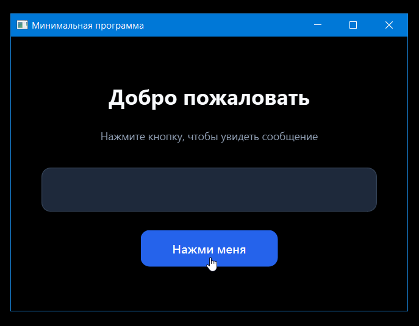

# ChatList

Python-приложение для отправки одного промта в несколько нейросетей и сравнения их ответов. Построено на PyQt6 и SQLite.

## Возможности

- Ввод нового промта или выбор сохранённого из базы
- Параллельная отправка в активные модели (OpenRouter, OpenAI, DeepSeek, Groq)
- Временная таблица результатов с чекбоксами для выбора
- Сохранение отмеченных ответов в постоянную БД
- Управление промтами, моделями, результатами и настройками
- Экспорт в Markdown и JSON
- Логи запросов в БД и файл `chatlist.log`

## Требования

- Python 3.11+
- Windows / Linux / macOS

## Установка

```powershell
cd c:\work-cursor\c14-chat_list
pip install -r requirements.txt
Copy-Item .env.example .env
```

Откройте `.env` и укажите API-ключи. Для OpenRouter достаточно одной переменной:

```env
OPENROUTER_API_KEY=sk-or-v1-ваш-ключ
```

## Запуск

```powershell
python main.py
```

При первом запуске создаётся `chatlist.db` с примерами моделей OpenRouter.

## Настройка моделей

На вкладке **Модели** можно включать/отключать нейросети. Поле **Переменная .env** должно совпадать с именем ключа в `.env` (например, `OPENROUTER_API_KEY`).

Бесплатные модели OpenRouter по умолчанию (в API — **с суффиксом `:free`**):

| Имя модели | Тип |
|------------|-----|
| `google/gemma-4-31b-it:free` | openrouter |
| `meta-llama/llama-3.3-70b-instruct:free` | openrouter |
| `openai/gpt-oss-20b:free` | openrouter |

Имя модели в базе совпадает с идентификатором в запросе к OpenRouter.

## Структура проекта

| Файл | Назначение |
|------|------------|
| `main.py` | Графический интерфейс |
| `db.py` | Работа с SQLite |
| `models.py` | Отправка промтов в API |
| `network.py` | HTTP-запросы |
| `session.py` | Временная таблица в памяти |
| `export_utils.py` | Экспорт MD / JSON |
| `PROJECT.md` | Спецификация |
| `PLAN.md` | План реализации |
| `DATABASE.md` | Схема БД |

## Тесты

```powershell
python -m unittest tests.test_scenarios -v
```

## Сборка exe

```powershell
pip install pyinstaller
pyinstaller chatlist.spec
```

Исполняемый файл: `dist\chatlist.exe`

Рядом с exe положите файл `.env` с API-ключами.

## Скриншот (первая версия)


